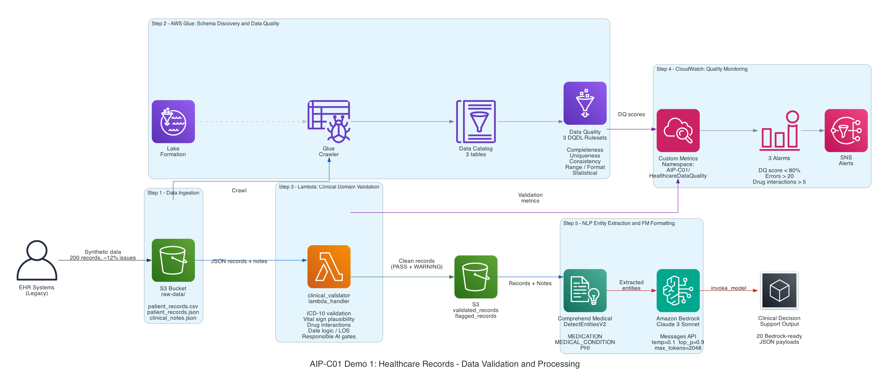

# AIP-C01 Domain 1: Data Validation & Processing

[](LICENSE)
[](https://www.python.org/downloads/)
[](https://aws.amazon.com/)
[](https://aws.amazon.com/certification/certified-ai-practitioner/)
[](demo-1-healthcare-records/)

Hands-on demos for **AWS Certified AI Practitioner (AIP-C01)** — Domain 1: Fundamentals of AI and ML, focusing on **data validation, quality monitoring, and Bedrock payload formatting** for foundation model pipelines.

---

## What This Project Does

A hospital network needs to process thousands of patient discharge summaries, lab reports, and clinical notes before feeding them to an Amazon Bedrock foundation model for **clinical decision support**. The data arrives from legacy EHR systems with abbreviations, missing fields, invalid ICD-10 codes, and encoding issues.

This project builds the complete **data validation and processing pipeline** that sits between raw healthcare data and a foundation model — ensuring every record is validated, standardized, and correctly formatted before it reaches Claude 3 Sonnet on Bedrock.

### Architecture



### Pipeline at a Glance

| Step | AWS Service | What It Does |
|------|-------------|--------------|
| **1. Data Ingestion** | Amazon S3 | Land 200 synthetic patient records (CSV + JSON) and clinical notes with ~12% intentional quality issues |
| **2. Schema Discovery & DQ** | AWS Glue + Lake Formation | Crawl data into a 3-table Data Catalog, then evaluate 3 DQDL rulesets covering completeness, uniqueness, consistency, range/format, and statistical checks |
| **3. Clinical Validation** | AWS Lambda | Run domain-specific checks: ICD-10 code validation, vital sign plausibility, drug interaction cross-referencing, date logic, and **Responsible AI pre-FM gates** (profanity, PHI exposure, bias detection, clinical relevance scoring) |
| **4. Quality Monitoring** | Amazon CloudWatch + SNS | Publish custom metrics to namespace `AIP-C01/HealthcareDataQuality`, trigger 3 alarms (DQ score < 80%, errors > 20, drug interactions > 5), and render a 6-widget dashboard |
| **5. NLP + FM Formatting** | Comprehend Medical + Bedrock | Extract MEDICATION, MEDICAL_CONDITION, and PHI entities via `DetectEntitiesV2`, then build 20 Claude 3 Sonnet `invoke_model` payloads (Messages API, temp=0.1, max_tokens=2048) |

---

## AIP-C01 Exam Coverage

| AIP-C01 Section | Requirement | Where It's Demonstrated |
|-----------------|-------------|-------------------------|
| 1.1 | AWS Glue Data Quality — DQDL rules for automated checks | [`glue_quality/glue_dq_rules.py`](demo-1-healthcare-records/glue_quality/glue_dq_rules.py) — 3 rulesets across CSV, JSON, and text tables |
| 1.3 | Custom Lambda validation — domain-specific business logic | [`lambda_validation/clinical_validator.py`](demo-1-healthcare-records/lambda_validation/clinical_validator.py) — `lambda_handler` with 6 validation categories |
| 1.4 | CloudWatch monitoring — metrics, alarms, dashboards | [`cloudwatch/quality_dashboard.py`](demo-1-healthcare-records/cloudwatch/quality_dashboard.py) — custom namespace, 3 alarms, 6-widget dashboard |
| 1.5 | Structured + unstructured data validation | CSV patient records + JSON nested records + free-text clinical notes — all validated with different strategies |
| 3.1 | Bedrock `invoke_model` — properly formatted JSON payloads | [`bedrock_formatting/format_for_bedrock.py`](demo-1-healthcare-records/bedrock_formatting/format_for_bedrock.py) + [`shared/utils/bedrock_helpers.py`](shared/utils/bedrock_helpers.py) |
| 4.2 | Amazon Comprehend Medical — entity extraction | `DetectEntitiesV2` simulation with real response schema — MEDICATION, MEDICAL_CONDITION, PHI categories |

---

## Demo

| Demo | Description | Status |
|------|-------------|--------|
| [**Demo 1: Healthcare Records**](demo-1-healthcare-records/) | End-to-end pipeline: synthetic data → Glue DQ → Lambda validation → CloudWatch monitoring → Comprehend entity extraction → Bedrock payload formatting | ✅ Complete |

---

## Project Structure

```
.
├── README.md                               # This file
├── LICENSE                                 # MIT License
├── .gitignore
├── .github/
│   └── images/
│       └── demo-1-architecture.png         # Architecture diagram
├── shared/
│   └── utils/
│       └── bedrock_helpers.py              # Bedrock invoke_model payload builder
└── demo-1-healthcare-records/
    ├── README.md                           # Detailed walkthrough & architecture
    ├── GLUE-DQ-EXPLAINED.md                # Deep-dive on DQDL rules
    ├── synth_data/                         # Step 1: Synthetic data generation
    │   └── generate_healthcare_data.py
    ├── glue_quality/                       # Step 2: Glue Data Quality rules
    │   └── glue_dq_rules.py
    ├── lambda_validation/                  # Step 3: Lambda domain validation
    │   └── clinical_validator.py
    ├── cloudwatch/                         # Step 4: CloudWatch monitoring
    │   └── quality_dashboard.py
    ├── bedrock_formatting/                 # Step 5: Comprehend + Bedrock formatting
    │   └── format_for_bedrock.py
    └── scripts/                            # AWS infrastructure automation
        ├── setup-aws-infra.sh              # Provision S3, Glue, Lambda, CloudWatch
        └── teardown-aws-infra.sh           # Clean up all resources
```

---

## Quick Start

```bash
git clone https://github.com/praveenc/aip-c01-domain-1-data-validation-processing.git
cd aip-c01-domain-1-data-validation-processing/demo-1-healthcare-records/
```

### Option A: Deploy to AWS (recommended)

Use the infrastructure script to provision all resources (S3, Glue, Lambda, CloudWatch) and run the full pipeline on AWS:

```bash
./scripts/setup-aws-infra.sh --dry-run     # Preview what will be created
./scripts/setup-aws-infra.sh               # Deploy everything
./scripts/setup-aws-infra.sh --cleanup     # Tear down when done
```

> Requires: AWS CLI configured with valid credentials, Python 3.9+, `zip`.

### Option B: Run locally (offline, no AWS needed)

Run each step individually using standard-library Python — no AWS credentials or third-party packages required:

```bash
python synth_data/generate_healthcare_data.py        # Step 1: Generate synthetic data
python glue_quality/glue_dq_rules.py                 # Step 2: Simulate Glue DQ rules
python lambda_validation/clinical_validator.py       # Step 3: Lambda domain validation
python cloudwatch/quality_dashboard.py               # Step 4: Generate CloudWatch configs
python bedrock_formatting/format_for_bedrock.py      # Step 5: Comprehend + Bedrock formatting
```

> All AWS API calls are represented as generated JSON configuration files in each step's `output/` directory.

---

## Requirements

- **Python 3.9+** (standard library only — no `pip install` needed)
- No AWS account required for local execution
- For production deployment: AWS account with Glue, Lambda, Bedrock, Comprehend Medical, and CloudWatch access

## License

This project is licensed under the [MIT License](LICENSE).
